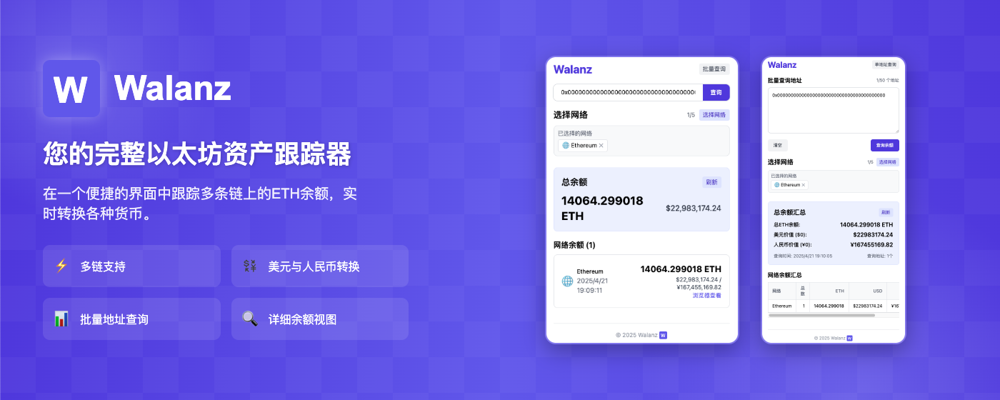

<p align="center">
  
</p>

<h1 align="center">Walanz Extension</h1>

<p align="center">Multi-chain Ethereum Balance Checker Chrome Extension</p>

<div align="center">
  <a href="#features">Features</a> •
  <a href="#tech-stack">Tech Stack</a> •
  <a href="#development-guide">Development Guide</a> •
  <a href="#build-and-installation">Build and Installation</a> •
  <a href="#usage-guide">Usage Guide</a> •
  <a href="#license">License</a>
</div>



---

## Features

- ✅ Multi-chain balance checking: Query ETH balances across numerous Ethereum-compatible chains
- ✅ Single & batch address queries: Support for single address or multiple addresses at once
- ✅ Real-time price conversion: Automatic conversion of ETH balances to USD and CNY
- ✅ Chain selector: Flexible selection of blockchains to query
- ✅ Intuitive interface: Clear display of balances and value totals
- ✅ Block explorer links: Convenient links to block explorers for detailed information

## Tech Stack

- **React**: UI building
- **TypeScript**: Type-safe codebase
- **TailwindCSS**: Styling
- **React Query**: Data fetching and caching
- **Vite**: Development and building
- **Recharts**: Data visualization charts

## Development Guide

### Install Dependencies

```bash
npm install
# or
yarn
# or
pnpm install
```

### Run Development Environment

```bash
npm run dev
# or
yarn dev
# or
pnpm dev
```

### Environment Variable Configuration

Create a `.env` file and set the API endpoint:

```
VITE_API_ENDPOINT=https://walanz.vercel.app
```

## Build and Installation

### Build Extension

```bash
npm run build
# or
yarn build
# or
pnpm build
```

### Install in Chrome

1. Open Chrome extensions page `chrome://extensions/`
2. Enable "Developer mode"
3. Click "Load unpacked"
4. Select the `dist` directory of the project

## Usage Guide

1. Click the Walanz icon in the browser toolbar
2. Enter an Ethereum address or batch addresses (toggle mode button)
3. Select the blockchains you want to query
4. View the balance results and value conversions

## License

[MIT License](LICENSE)